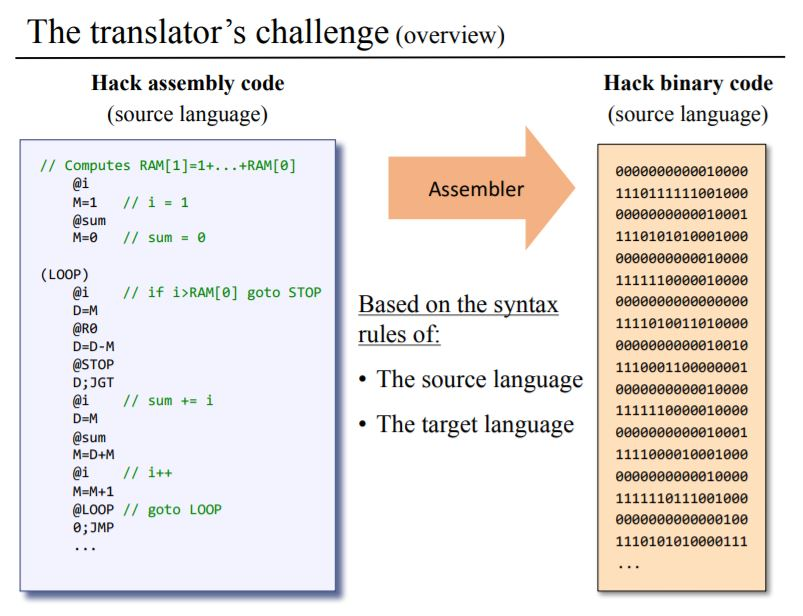

# Hack Assembler  

This is a program, written in Python 3, that translates symbolic assembly code commands into 16-bit binary code.

The binary code is designed to run on a simple general-purpose computer, which is built in a course called From Nand to Tetris. An accompanying book is called The Elements of Computing Systems: Building a Modern Computer from First Principles. See reference links below. 

The Hack computer is built from scratch, starting with logic and flip-flop gates and working up to ALU, RAM and CPU chips. The assembler is the first software layer before moving on to building a virtual machine, compiler and operating system. 

\

### Usage

Hack Assembler reads an assembly program - such as Add.asm - located in data/input/ and produces a translated file - in this case, Add.hack - in data/output/. Correctly translated files in data/compare/ are used for testing.  

As an example, to translate Pong.asm, use this command-line argument from root folder: `python -m assembler Pong.asm` 

To run a test module, such as phase1: `python -m tests.phase1`

To run a specific test, note addition of unittest: `python -m unittest tests.phase1.Parser.test_init`

### References

- https://docs.wixstatic.com/ugd/56440f_65a2d8eef0ed4e0ea2471030206269b5.pdf
- https://docs.wixstatic.com/ugd/44046b_89a8e226476741a3b7c5204575b8a0b2.pdf
- https://www.nand2tetris.org/software
- https://www.amazon.com/Elements-Computing-Systems-Building-Principles/dp/0262640686/ref=ed_oe_p
- https://www.coursera.org/learn/build-a-computer
- https://www.coursera.org/learn/nand2tetris2
